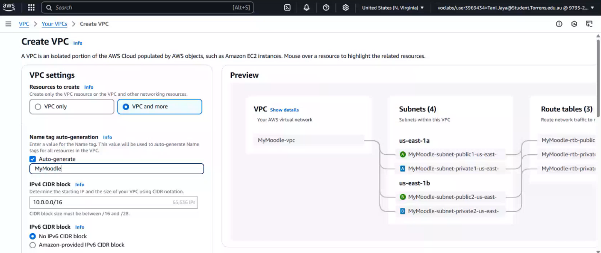
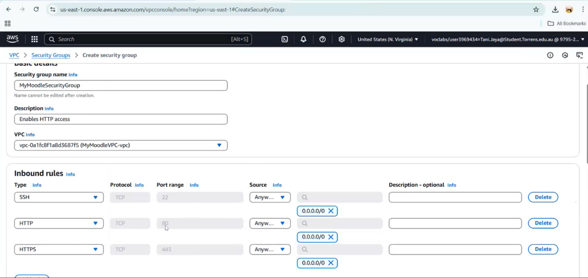
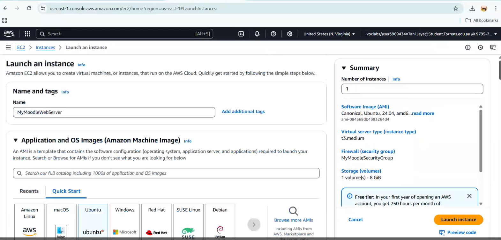
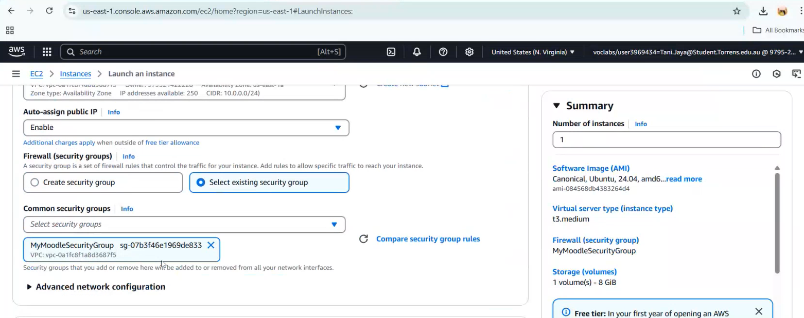
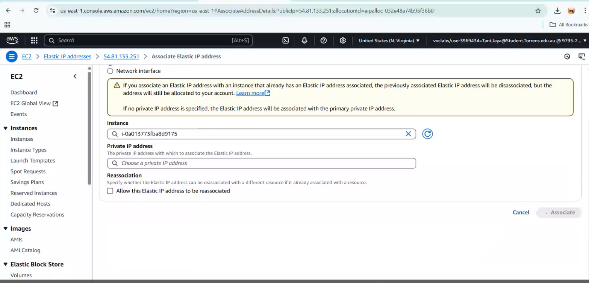
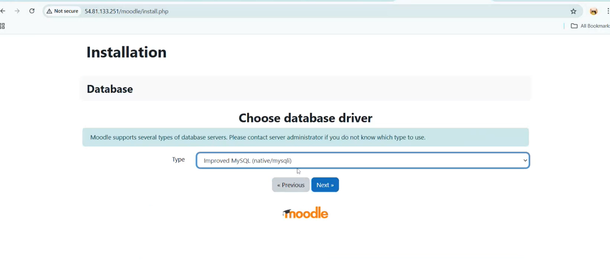
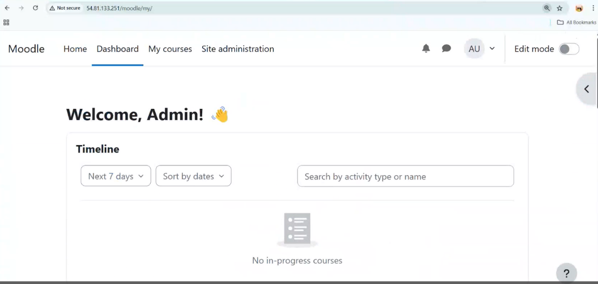

# Deployment guide

Step-by-step walkthrough of deploying Moodle on AWS EC2, from network setup through to a live, publicly accessible application.

## Architecture

Architecture diagram available in `architecture/aws-architecture.png`

## Prerequisites

Before beginning the deployment, ensure you have:

- AWS account (AWS Academy Learner Lab or AWS Free Tier)
- EC2 key pair
- Ubuntu 24.04 LTS AMI
- Basic Linux command-line knowledge
- Git installed

## 1. Create the VPC

Created a Virtual Private Cloud as the networking foundation for the deployment. The VPC gives control over the IP address range, subnets, and availability zones, and keeps the EC2 instance inside an isolated network rather than exposed directly to the internet. Two subnets were configured: a public subnet for the web server and a private subnet reserved for the database tier.

## 2. Create the security group

Configured a security group with three inbound rules: **SSH (22)** for remote administration, **HTTP (80)** and **HTTPS (443)** for web traffic. Security groups act as a stateful firewall at the instance level, restricting traffic by IP and port before it ever reaches the server, separate from any user/service-level IAM permissions.

## 3. Launch the EC2 instance

Launched an EC2 instance (`MyMoodleWebServer`) running **Ubuntu**. Ubuntu was chosen for its free-tier eligibility, straightforward package management, and strong community documentation for PHP-based applications like Moodle. Instance type: **t3.medium** (2 vCPUs, 4 GB RAM), enough headroom for a lightweight production-style Moodle deployment without over-provisioning.

## 4. Attach the security group

Attached the security group created in step 2 to the new instance rather than defining rules ad hoc. Reusing a pre-built security group reduces configuration drift and keeps the setup consistent, particularly useful in constrained environments like the AWS Academy Learner Lab, where custom network configuration is limited.

## 5. Associate an Elastic IP

Allocated and associated an Elastic IP with the instance so the server has a **static public IP address** that survives instance stops/restarts. Without this, the public IP would change on every restart and break access to the deployed application.

## 6. Install and configure the stack

Installed Apache, PHP, and MySQL on the Ubuntu EC2 instance, then configured PHP settings required by Moodle (including `max_input_vars`) and updated Apache to serve the Moodle application correctly.

The complete installation commands are available in:

`scripts/install.sh`

MySQL was used as the backend database. It's the most widely supported, fully compatible option for Moodle's data layer.

## 7. Verify the live deployment

Confirmed the application was reachable over the public IP, with the web server, database, and Moodle application files all correctly integrated.

## Troubleshooting notes

| Issue | Resolution |
|---|---|
| `max_input_vars` too low for Moodle's setup forms | Edited `php.ini`, uncommented and raised `max_input_vars = 5000`, restarted Apache |
| Moodle installer asks for manual `config.php` | Created `config.php` by hand from the installer's generated code, then fixed ownership (`www-data:www-data`) and permissions (`644`) |
| Elastic IP not yet associated | Public IP changed after instance restart during early testing — resolved by allocating and associating an Elastic IP (step 5) |

## Next steps for production readiness

- **Application Load Balancer** — handle higher workloads without downtime
- **Amazon RDS** — managed database with automated backups, off-instance
- **HTTPS via ACM/Let's Encrypt** — encrypt traffic between users and server
- **Amazon CloudWatch** — alerting on abnormal activity or resource limits

## Conclusion

This deployment demonstrates the end-to-end process of provisioning cloud infrastructure on AWS, configuring networking and security, deploying a Linux-based web application, and validating successful public access.

The project strengthened practical skills in AWS, Linux administration, cloud networking, web server configuration, and deployment troubleshooting.